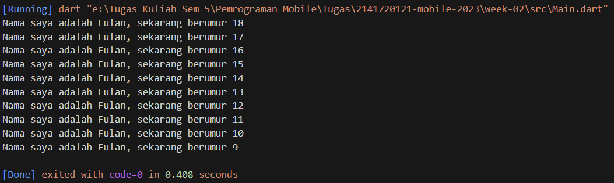

# Pemrograman Mobile - Pertemuan 2

Project Hello World

NIM  : 2141720121

Nama : Yofandra Arta Priyoga

## Tugas Praktikum 
1. Kode Program :
```
void main(){
  for (int i = 18; i > 8; i--){
    print('Nama saya adalah Fulan, sekarang berumur ${i}');
  }
}
```
output : 


2. Karena pada framework flutter menggunakan bahasa pemrograman dart. Jika tidak bisa memahami dart maka juga tidak bisa menggunakan framework flutter.
<br>

3. Rangkuman Materi.
#### Struktur Dart Language
* ##### Object Orientation
Dart dirancang untuk object-oriented (OO). Secara singkat, Bahasa OOP didasarkan pada konsep objek yang menyimpan kedua data (disebut fields) dan kode (disebut methods). Objek-objek ini dibuat dari cetak biru yang disebut class yang mendefinisikan field dan method yang akan dimiliki oleh sebuah objek.

* ##### Dart Operator
Di Dart, operator tidak lebih dari method yang didefinisikan dalam class dengan sintaks khusus. Jadi, ketika Anda menggunakan operator seperti x == y, seolah-olah Anda sedang memanggil x.==(y) metode untuk melakukan perbandingan kesetaraan.  

* ##### Arithmetic Operators  
    * '+' untuk tambahan.
    * '-' untuk pengurangan.
    * '*' untuk perkalian.
    * '/' untuk pembagian.
    * '~/' untuk pembagian bilangan bulat. Di Dart, setiap pembagian sederhana dengan / menghasilkan nilai double. Untuk mendapatkan nilai bilangan bulat, Anda perlu membuat semacam transformasi (yaitu, typecast) dalam bahasa pemrograman lain; namun Dart sudah mendukung untuk operasi ini.
    * '%' untuk operasi modulus (sisa bagi dari bilangan bulat).
    * '-expression' untuk negasi (yang membalikkan suatu nilai).

* ##### Increment & Decrement Operators
Operator penambahan dan pengurangan juga merupakan operator umum dan diimplementasikan pada angka, sebagai berikut:

    ++var atau var++ untuk menambah nilai variabel var sebesar 1

    --var atau var-- untuk mengurangi nilai variabel var sebesar 1    

* ##### Equality & Relational Operators
Persamaan operator Dart dijelaskan sebagai berikut:
* == untuk memeriksa apakah operan sama
* != untuk memeriksa apakah operan berbeda

Untuk melakukan pengujian relasional, maka gunakan operator sebagai berikut:

* '>' memeriksa apakah operan kiri lebih besar dari operan kanan
* '<' memeriksa apakah operan kiri lebih kecil dari operan kanan
* '>=' memeriksa apakah operan kiri lebih besar dari atau sama dengan operan kanan
* '<=' memeriksa apakah operan kiri kurang dari atau sama dengan operan kanan     
<br>
* ##### Logical Operators
Operator logika di Dart adalah operator yang diterapkan pada operan bool; bisa berupa variabel, ekspresi, atau kondisi. Selain itu, dapat dikombinasikan dengan ekspresi kompleks dengan menggabungkan nilai ekspresi yang dievaluasi. Operator logika yang disediakan adalah sebagai berikut:

* !expression negasi atau kebalikan hasil ekspresi—yaitu, true menjadi false dan false menjadi true.
* || menerapkan operasi logika OR antara dua ekspresi.
* && menerapkan operasi logika AND antara dua ekspresi.


