# Pemrograman Mobile - Pertemuan 4

NIM : 2141720121

Nama : Yofandra Arta Priyoga

<br>

## Praktikum 1

#### Langkah 1

##### Kode Program

```
void main() {
  var list = [1, 2, 3];
  assert(list.length == 3);
  assert(list[1] == 2);
  print(list.length);
  print(list[1]);

  list[1] = 1;
  assert(list[1] == 1);
  print(list[1]);
}
```

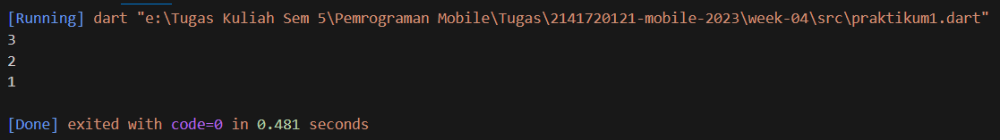

#### Langkah 2

Penjelasan:

- Kode melakukan operasi assert bahwa panjang list adalah 3 dan elemen pada index 1 adalah 2,
- kemudian melakukan pencetakan panjang list yang menghasilkan output 3.
- Lalu melakukan pencetakan elemen pada indeks 1 yang menghasilkan output 2.
- Setelah itu kode mengubah nilai elemen indeks 1 menjadi 1.
- Kode melakukan operasi assert bahwa elemen pada indeks 1 adalah 1
- Lalu melakukan pencetakan elemen pada indeks ke 1 yang menghasilkan output 1

#### Langkah 3

##### Kode Program

```
void main() {
  final list = List<Object?>.filled(5,null);
  assert(list.length == 3);
  assert(list[1] == 2);
  print(list.length);
  print(list[1]);

  list[1] = 'Yofandra';
  list[2] = 2141720121;
  assert(list[1] == 1);
  print(list[1]);
  print(list[2]);
}
```

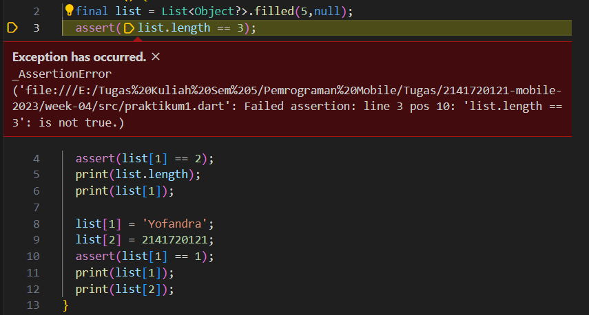

Penjelasan: Terjadi error karena pada line 3 dilakukan assert bahwa panjang list adalah 3 yang seharusnya panjang list adalah 5. Terjadi juga pada seluruh kode yang menjalankan assert karena tidak ada yang sesuai

##### Perbaikan Kode

```
void main() {
  final list = List<Object?>.filled(5,null);
  assert(list.length == 5);
  assert(list[1] == null);
  print(list.length);
  print(list[1]);

  list[1] = 'Yofandra';
  list[2] = 2141720121;
  assert(list[1] == 'Yofandra');
  print(list[1]);
  print(list[2]);
  print(list);
}
```

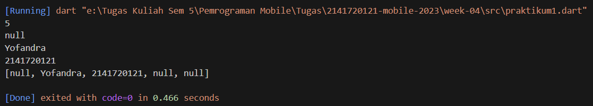

<br>

## Praktikum 2

#### Langkah 1

##### Kode Program

```
void main() {
  var halogens = {'fluorine', 'chlorine', 'bromine', 'iodine', 'astatine'};
  print(halogens);
}
```

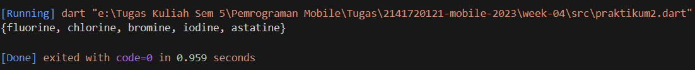

#### Langkah 2

Penjelasan : Kode tersebut mendeklarasikan set 'halogens' dengan 5 elemen. Kemudian melakukan pencetakan pada semua isi set 'halogens'

#### Langkah 3

##### Kode Program

```
void main() {
  var halogens = {'fluorine', 'chlorine', 'bromine', 'iodine', 'astatine'};
  print(halogens);

  var names1 = <String>{};
  Set<String> names2 = {}; // This works, too.
  var names3 = {}; // Creates a map, not a set.

  print(names1);
  print(names2);
  print(names3);
}
```

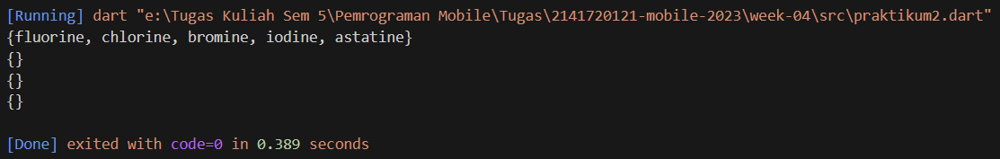

Penjelasan: Kode melakukan pendeklarasian set 'names1' dan 'names2' dengan cara yang berbeda. Sedangkan 'names3' merupakan pendeklarasian map

##### Perbaikan Kode

```
void main() {
  var halogens = {'fluorine', 'chlorine', 'bromine', 'iodine', 'astatine'};
  print(halogens);

  var names1 = <String>{};
  names1.add('Yofandra');
  names1.add('2141720121');
  Set<String> names2 = {};
  names2.addAll({'Yofandra','2141720121'});

  print(names1);
  print(names2);
}
```

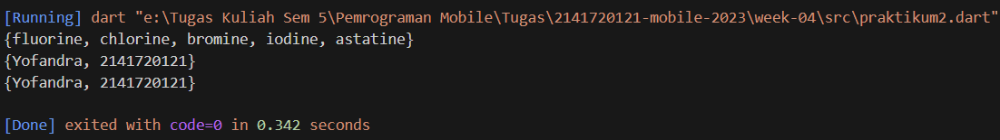

<br>

## Praktikum 3

#### Langkah 1

##### Kode Program

```
void main() {
  var gifts = {
    // Key:    Value
    'first': 'partridge',
    'second': 'turtledoves',
    'fifth': 1
  };

  var nobleGases = {
    2: 'helium',
    10: 'neon',
    18: 2,
  };

  print(gifts);
  print(nobleGases);
}
```

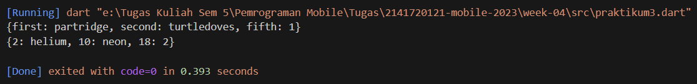

#### Langkah 2

Penjelasan :

#### Langkah 3

##### Kode Program

```
void main() {
  var gifts = {
    // Key:    Value
    'first': 'partridge',
    'second': 'turtledoves',
    'fifth': 1
  };

  var nobleGases = {
    2: 'helium',
    10: 'neon',
    18: 2,
  };

  var mhs1 = Map<String, String>();
  gifts['first'] = 'partridge';
  gifts['second'] = 'turtledoves';
  gifts['fifth'] = 'golden rings';

  var mhs2 = Map<int, String>();
  nobleGases[2] = 'helium';
  nobleGases[10] = 'neon';
  nobleGases[18] = 'argon';

  print(gifts);
  print(nobleGases);
}
```

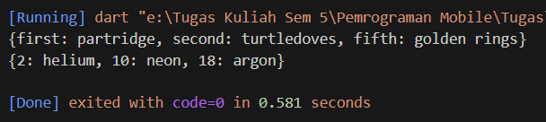
Penjelasan : Output tetap sama karena variabel 'mhs1' dan 'mhs2' hanya dideklarasikan tanpa digunakan

##### Perbaikan Kode:

```
void main() {
  var gifts = {
    // Key:    Value
    'first': 'partridge',
    'second': 'turtledoves',
    'fifth': 1
  };

  var nobleGases = {
    2: 'helium',
    10: 'neon',
    18: 2,
  };

  var mhs1 = Map<String, String>();
  mhs1['nama'] = 'Yofandra A.P';
  mhs1['nim'] = '2141720121';

  gifts['first'] = 'partridge';
  gifts['second'] = 'turtledoves';
  gifts['fifth'] = 'golden rings';
  gifts['sixth'] = 'Yofandra A.P';
  gifts['seventh'] = '2141720121';

  var mhs2 = Map<int, String>();
  mhs2[1] = 'Yofandra A.P';
  mhs2[2] = '2141720121';

  nobleGases[2] = 'helium';
  nobleGases[10] = 'neon';
  nobleGases[18] = 'argon';
  nobleGases[25] = 'Yofandra A.P';
  nobleGases[30] = '2141720121';

  print(gifts);
  print(nobleGases);
  print(mhs1);
  print(mhs2);
}
```

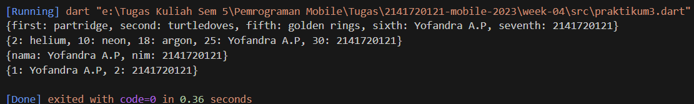

<br>

### Praktikum 4

#### Langkah 1

##### Kode Program

```
void main() {
  var list = [1, 2, 3];
  var list2 = [0, ...list];
  print(list1);
  print(list2);
  print(list2.length);
}
```

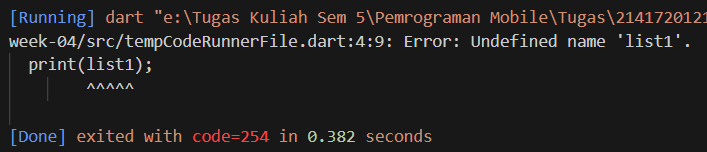

Penjelasan : Terjadi error karena 'list1' tidak pernah di deklarasi. Maka ubah 'list1' menjadi 'list'

#### Langkah 2

##### Perbaikan Kode

```
void main() {
  var list = [1, 2, 3];
  var list2 = [0, ...list];
  print(list);
  print(list2);
  print(list2.length);
}
```

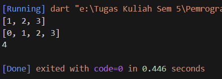

#### Langkah 3

##### Kode Program

```
void main() {
  var list = [1, 2, 3];
  var list2 = [0, ...list];
  print(list);
  print(list2);
  print(list2.length);

  list1 = [1, 2, null];
  print(list1);
  var list3 = [0, ...?list1];
  print(list3.length);
}
```

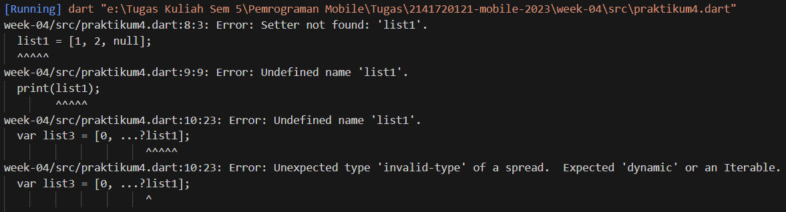

Penjelasan : Terjadi error karena saat pendeklarasian 'list1' tidak diberi tipe data dan pada 'list3' ada tanda '?' yang tidak perlu pada spread operator

##### Perbaikan Kode

```
void main() {
  var list = [1, 2, 3];
  var list2 = [0, ...list];
  print(list);
  print(list2);
  print(list2.length);

  var list1 = [1, 2, 2141720121, null];
  print(list1);
  var list3 = [0, ...list1];
  print(list3.length);
}
```

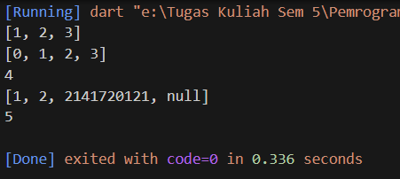

#### Langkah 4

##### Kode Program

```
var nav = ['Home', 'Furniture', 'Plants', if (promoActive) 'Outlet'];
print(nav);
```

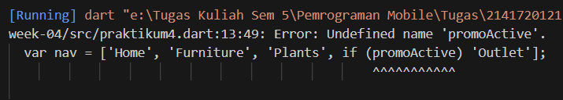

Penjelasan : Terjadi error karena variabel 'promoActive' belum dideklarasikan

##### Kondisi true

```
var promoActive = true;
var nav = ['Home', 'Furniture', 'Plants', if (promoActive) 'Outlet'];
print(nav);
```

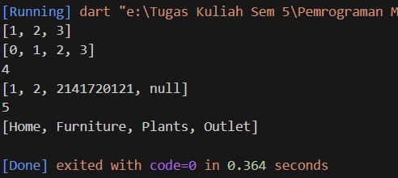

##### Kondisi false

```
var promoActive = false;
var nav = ['Home', 'Furniture', 'Plants', if (promoActive) 'Outlet'];
print(nav);
```


#### Langkah 5

##### Kode Program

```
var nav2 = ['Home', 'Furniture', 'Plants', if (login case 'Manager') 'Inventory'];
print(nav2);
```

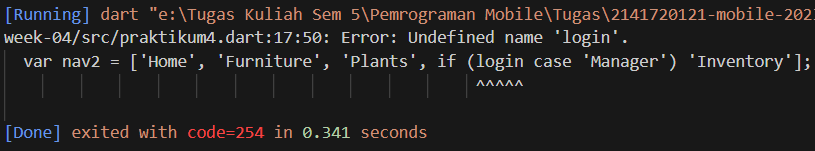

penjelasan : terjadi error karena variabel 'login' belum dideklarasikan

##### Kondisi 'Manager'

```
var login = 'Manager';
var nav2 = ['Home', 'Furniture', 'Plants', if (login case 'Manager') 'Inventory'];
print(nav2);
```

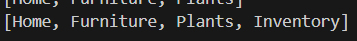

##### Kondisi lain

```
var login = 'CEO  ';
var nav2 = ['Home', 'Furniture', 'Plants', if (login case 'Manager') 'Inventory'];
print(nav2);
```

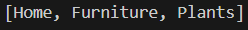

#### Langkah 6

##### Kode Program

```
var listOfInts = [1, 2, 3];
var listOfStrings = ['#0', for (var i in listOfInts) '#$i'];
assert(listOfStrings[1] == '#1');
print(listOfStrings);
```

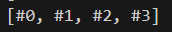

Penjelasan : Collection For digunakan untuk membuat data pada list yang memiliki pola berulang

<br>

### Praktikum 5

#### Langkah 1

##### Kode Program

```
void main(){
  var record = ('first', a: 2, b: true, 'last');
  print(record)
}
```

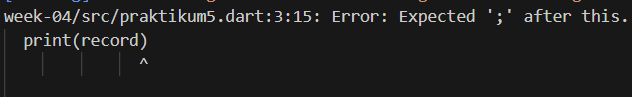
Penjelasan : Terjadi error karena kurang ';'

#### Langkah 2

##### Perbaikan kode

```
void main(){
  var record = ('first', a: 2, b: true, 'last');
  print(record);
}
```

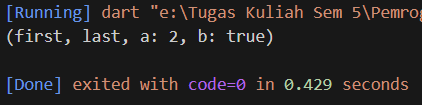

#### Langkah 3

##### Kode Program

```
void main() {
  var record = ('first', a: 2, b: true, 'last');
  print(record);
}

(int, int) tukar((int, int) record) {
  var (a, b) = record;
  return (b, a);
}
```

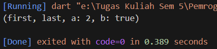

Penjelasan : Tidak terjadi perubahan pada output

##### Perbaikan kode

```
void main() {
  var record2 = (20, 30);
  print(tukar(record2));
}

(int, int) tukar((int, int) record) {
  var (a, b) = record;
  return (b, a);
}
```

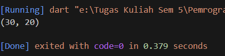

#### Langkah 4

##### Kode Program

```
(String, int) mahasiswa;
print(mahasiswa);
```

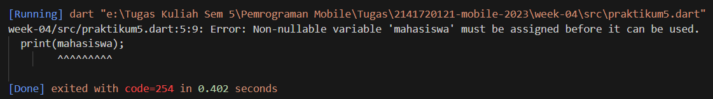

Penjelasan : Terjadi error karena variabel 'mahasiswa' memiliki nilai null

##### Perbaikan Kode

```
(String, int) mahasiswa;
mahasiswa = ('Yofandra A.P', 2141720121);
print(mahasiswa);
```

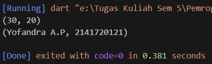

#### Langkah 5

##### Kode Program

```
var mahasiswa2 = ('first', a: 2, b: true, 'last');

print(mahasiswa2.$1); // Prints 'first'
print(mahasiswa2.a); // Prints 2
print(mahasiswa2.b); // Prints true
print(mahasiswa2.$2); // Prints 'last'
```

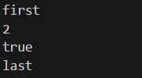

Penjelasan : Tidak terjadi error (Berhasil)

##### Ganti isi record

```
var mahasiswa2 = ('Yofandra A.P', a: 2141720121, b: true, 'last');

print(mahasiswa2.$1);
print(mahasiswa2.a);
print(mahasiswa2.b);
print(mahasiswa2.$2);
```

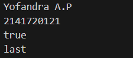

<br>

### Tugas Praktikum

2. Function merupakan objek yang memiliki tipe dan melakukan tugas tertentu. Function juga dapat memiliki parameter yang diperlukan, opsional, bernama, dan posisional
   <br>

3. Beberapa jenis parameter:

- Required Parameters, yaitu parameter yang harus diberikan ketika memanggil fungsi
  ```
  void identitas(String nama) {
  print('$nama!');
  }
  ```
- Optional Parameters, yaitu parameter tidak wajib diberikan ketika memanggil fungsi. Ada 2 jenis optional parameter yaitu:
  - Named Parameters, menggunakan {} untuk deklarasi
    ```
    void printData({String nama, int nomorBuku}) {
      print('Nama: $nama, Nomor Buku: $nomorBuku');
    }
    ```
  - Positional Parameters, menggunakan [] untuk deklarasi
    ```
    void showInfo(String name, [int age = 30]) {
      print('Name: $name, Age: $age');
    }
    ```

4. Berarti bahwa kita dapat memperlakukan fungsi sebagai nilai dari jenis lain

   ```
   void data(String nama) {
     print('Nama:  $nama!');
   }

   void main() {
     var info = data;
     info('Yofandra');
   }
   ```

5. Merupakan fungsi yang tidak memiliki nama. Fungsi ini digunakan untuk membuat blok kode yang dapat dipanggil tanpa harus memberikan nama terlebih dahulu

   ```
   var add = (int a, int b) => a + b;
   ```

6. Perbedaan Lexical scope dan Lexical closures

- Lexical scope, adalah variabel yang dideklarasikan dalam suatu blok kode hanya dapat diakses di dalam blok kode tersebut atau di dalam blok kode anak yang bersarang di dalamnya

  ```
  void main() {
    var x = 10;

    void printX() {
        print(x); // Variabel x diambil dari lexical scope
    }

    printX();
  }
  ```

- Lexical closures, adalah fungsi yang dapat mengakses variabel di dalam Lexical scope-nya, bahkan ketika fungsi tersebut digunakan di luar Lexical scope aslinya

  ```
  Function makeCounter() {
    var count = 0;
    return () {
        return ++count;
    };
    }

    void main() {
    var counter = makeCounter();

    print(counter()); // 1
    print(counter()); // 2
  }
  ```

7. ```
   import 'package:tuple/tuple.dart';

   Tuple2<int, String> foo() {
     return Tuple2(42, "foobar");
   }

   void main() {
     var result = foo();
     print(result.item1); // 42
     print(result.item2); // foobar
   }
   ```
