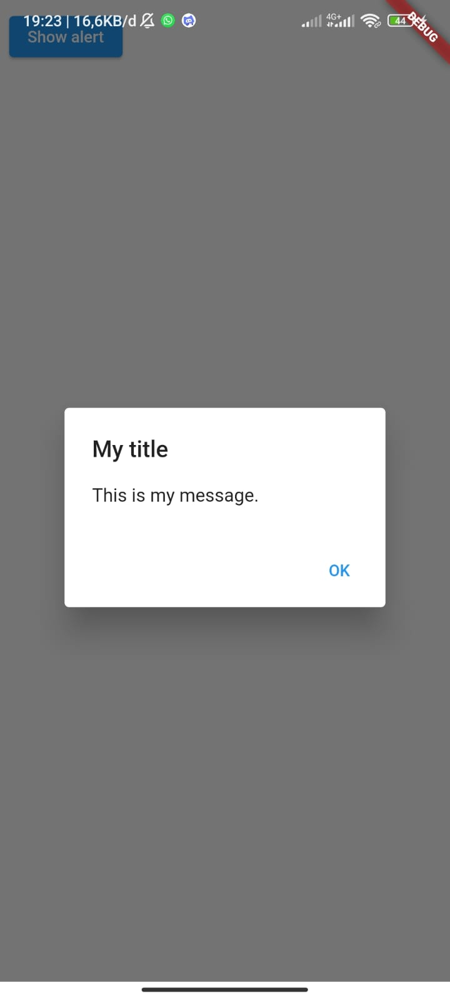

# Pemrograman Mobile - Pertemuan 5

NIM : 2141720121

Nama : Yofandra Arta Priyoga

 

## Praktikum 1

#### Langkah 1

Buat Projek Flutter

#### Langkah 2

Select folder

#### Langkah 3

Buat nama project flutter

#### langkah 4

Projek Flutter berhasil dibuat

 

## Praktikum 2

#### Langkah 11

Running projek flutter

#### Langkah 12

Ubah nama

 

## Praktikum 3

#### Langkah 1

Text widget

#### Langkah 2

Image Widget

 

## Praktikum 4

#### Langkah 1

Cupertino Button dan Loading Bar

#### Langkah 2

Floating Action Button (FAB)

#### Langkah 3

Scaffold Widget

#### Langkah 4

Dialog Widget

#### Langkah 5

Input dan Selection Widget

#### Langkah 6

Date and Time Pickers

 

## Tugas Praktikum

### No.3

#### Create Project

#### Add Button

#### Make the app prettier

#### Add functionality

#### Add navigation rail

#### Add new page

#### Hasil Tugas Praktikum

