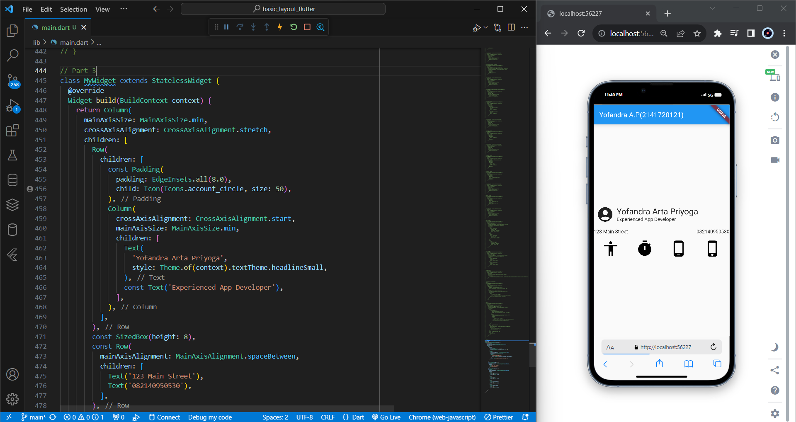

# Pemrograman Mobile - Pertemuan 7

NIM : 2141720121

Nama : Yofandra Arta Priyoga

 

## Praktikum 1

#### Membangun Layout di Flutter

## Praktikum 2

#### Implementasi button row

## Praktikum 3

#### Implementasi text section

## Praktikum 4

#### Implementasi image section

 

## Tugas Praktikum

#### 1. Row and Column classes

Penggunaan Row

Penggunaan Column

#### 2. Axis size and alignment

Penggunaan Max

Penggunaan Min

#### 3. mainAxisAlignment property

Penggunaan Start

Penggunaan End

#### 4. crossAxisAlignment property

Penggunaan Center

Penggunaan Start

#### 5. Flexible widget

Penggunaan Loose

Penggunaan Tight

#### 6. Expanded widget

Tampilan awal

Setelah di Expand

#### 7. SizedBox widget

Penggunaan width 100

Penambahan height 100

Penggunaan space

#### 8. Spacer widget

Penggunaan 1 flex

Penggunaan 2 flex

#### 9. Text widget

Penggunaan Center

Penggunaan Baseline

#### 10. Icon widgett

Penggunaan Icon

Penggunaan Icon lain

#### 11. Image widget

Penggunaan pic1

Penggunaan pic2

#### 12. Putting it all together

Part 1

Part 2

Part 3

