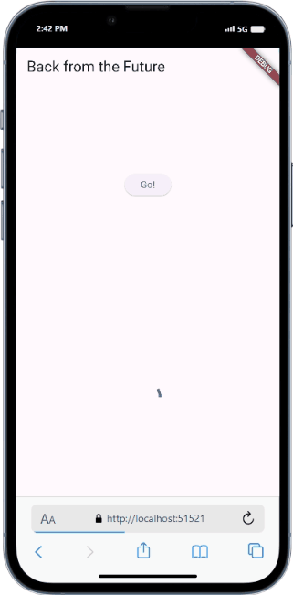
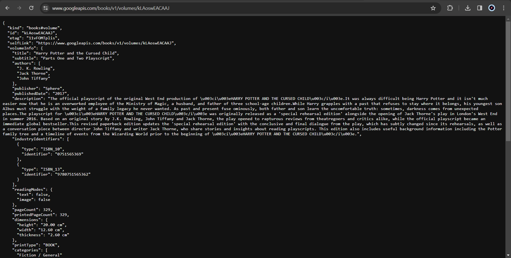
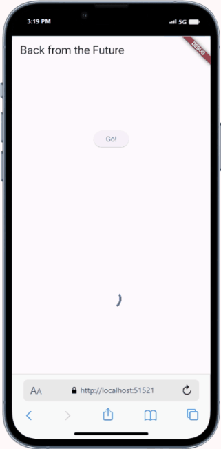
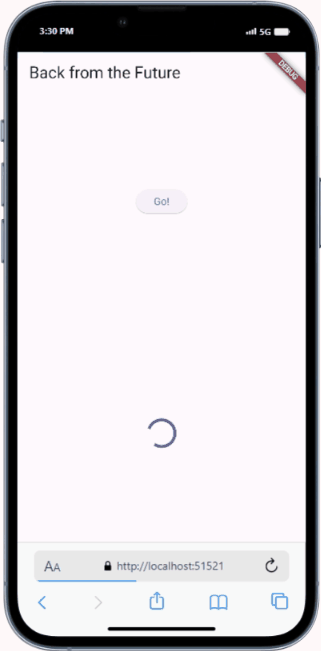
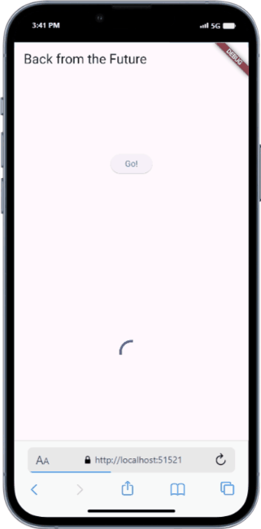
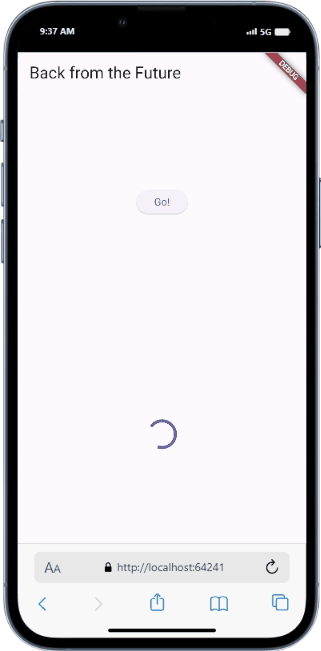

# Pemrograman Mobile - Pertemuan 12

NIM : 2141720121

Nama : Yofandra Arta Priyoga

 

## Praktikum 1

#### Soal 1

 

#### Soal 2

 

#### Soal 3
Penjelasan :
substring digunakan untuk mendapatkan string dengan mengambil 450 karakter pertama, sedangkan catchError adalah metode yang dipanggil jika terjadi kesalahan saat menjalankan future.

Output:

 

#### Soal 4
Penjelasan:
Pada langkah 1, kode tersebut merupakan fungsi asinkron untuk menunda eksekusi selama tiga detik setiap fungsinya. Sedangkan pada langkah kedua, fungsi asinkron yang menunggu 3 fungsi pada langkah 1 yang akan menghitung dan menyimpan total dalam variabel result

Output: 

 

#### Soal 5
Penjelasan:
Pada langkah 2, pertama mendeklarasikan completer. Fungsi getNumber() menginisialisasi completer dan memanggil fungsi calculate() untuk mengembalikan future. Fungsi calculate sendiri adalah fungsi asinkron yang menunda eksekusi selama 5 detik dan kemudian menyelesaikan completer dengan nilai 42

Output: 

 

#### Soal 6
Penjelasan:
Pada langkah 5, sama seperti langkah sebelumnya namun jika ada kesalahan selama eksekusi, maka fungsi ini menyelesaikan completer dengan kesalahan. Begitu pula pada langkah ke 6, jika terjadi kesalahan saat menyelesaikan Future, maka blok catchError akan dieksekusi dan result akan diatur ke 'An error occurred'

Output: 

 

#### Soal 7
Output: 

 

#### Soal 8
Penjelasan:
Perbedaannya adalah Dengan FutureGroup, kita dapat menambahkan Future secara dinamis ke grup setelah pembuatan grup. Sebaliknya, Future.wait() memerlukan semua Future pada saat pembuatan dan tidak dapat menambahkan Future setelah itu. Selain itu, Jika salah satu Future dalam Future.wait() gagal, maka Future yang dikembalikan oleh Future.wait() juga akan gagal dengan kesalahan yang sama, dan semua Future yang belum selesai akan dibatalkan. Sebaliknya, FutureGroup akan menunggu semua Future selesai, bahkan jika beberapa di antaranya gagal.
 

#### Soal 9
Output: 

 

#### Soal 10
Penjelasan: 
Fungsi returnError() menjalankan operasi asinkron kemudian menjalankan Exception setelah delay 2 detik. Sedangkan pada fungsi handleError() ketika ada exception yang dihasilkan returnError(), catch akan menangkap dan setState akan mengupdate state dengan pesan error

#### Soal 12
Penjelasan:
Bisa, karena flutter web yang menggunakan API Geolocation langsung dari browser

Output: 

 