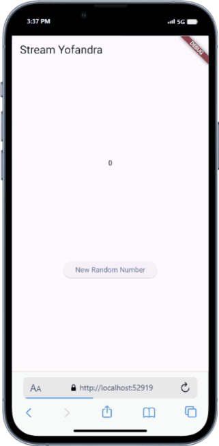
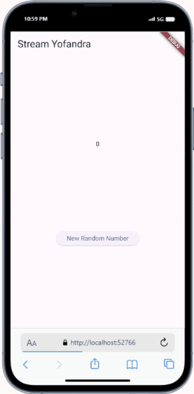
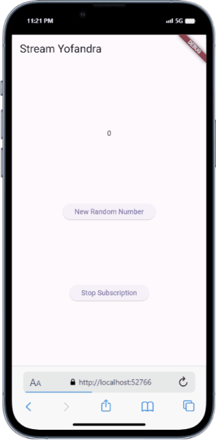
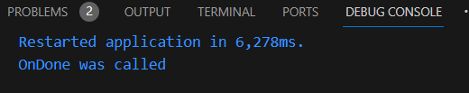
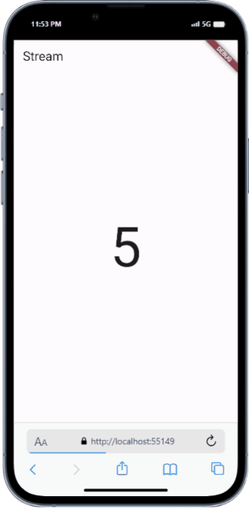

# Pemrograman Mobile - Pertemuan 13

NIM : 2141720121

Nama : Yofandra Arta Priyoga

 

#### Soal 3
* Keyword yield* digunakan untuk mendelegasikan ke Stream.periodic
* Isi perintah kode tersebut untuk menghasilkan urutan nilai setiap detik, dan fungsi ini menghasilkan warna dari arrays colors berdasarkan indeks yang dihitung dari waktu.
 

#### Soal 4
Output: 

 

#### Soal 5
Penjelasan:
listen: Eksekusi kode berlanjut setelah dipanggil. Berarti kode setelah listen dapat dieksekusi sebelum stream selesai
await for: menunda eksekusi kode sampai stream selesai. Ini berarti bahwa kode setelah await for tidak akan dieksekusi sampai semua event di stream telah diproses.

#### Soal 6
Penjelasan:
Kode pada langkah 8 ini mendengarkan stream angka dari NumberStream, dan setiap kali angka baru tersedia, ia mengubah lastNumber menjadi angka tersebut dan memperbarui UI. Sedangkan kode pada langkah 10 ini menghasilkan angka acak dan menambahkannya ke dalam stream

Output:

 

#### Soal 7
Penjelasan:
* Langkah 13 : Menambahkan fungsi addError() yang ketika dipanggil, maka error 'error' akan ditambahkan ke dalam sink dari StreamController
* Langkah 14 : Menambah bagian Stream, Jadi, jika ada error yang ditambahkan ke dalam Stream, maka lastNumber akan diubah menjadi -1 dan widget akan di-render ulang
* Langkah 15 : Menambahkan error ke dalam Stream yang bernama numberStream yang sudah ditambahkan tadi

#### Soal 8
Penjelasan:
* Langkah 1 : Menambahkan variabel transformer
* Langkah 2 : Mendefinisikan sebuah StreamTransformer, dimana transformer ini akan mengubah setiap angka di Stream menjadi 10 kali lipat dari nilai aslinya, atau menjadi -1 jika terjadi error. Ketika Stream selesai, sink akan ditutup
* Langkah 3 : Mengubah data yang mengalir melalui Stream menggunakan transformer, dan kemudian mendengarkan data tersebut. Setiap kali ada data baru, fungsi dalam listen akan dipanggil dengan data baru tersebut sebagai argumen

Output:

 

#### Soal 9
Penjelasan:
* Langkah 2 : Mendengarkan data yang mengalir melalui Stream dan menyimpan StreamSubscription ke dalam variabel subscription. Setiap kali ada data baru, fungsi dalam listen akan dipanggil dengan data baru tersebut sebagai argumen
* Langkah 6 : Ketika memanggil subscription.cancel(), maka akan berhenti mendengarkan Stream dan tidak akan menerima data baru lagi.
* Langkah 8 : Menghasilkan angka acak dan menambahkannya ke dalam Stream, atau mengubah lastNumber menjadi -1 jika StreamController sudah ditutup.

Output:

 

#### Soal 10
Penjelasan : Hal ini dikarenakan penggunaan subscription pada stream yang sama tanpa menutup subscription sebelumnya
 

#### Soal 11
Penjelasan : Hal ini dikarenakan penggunaan asBroadcastStream() membuat stream menjadi bisa didengarkan oleh beberapa subscription sekaligus

Output:

 

#### Soal 12
Penjelasan : 
* Langkah 3 : Mendefinisikan sebuah kelas NumberStream, lalu membuat objek NumberStream dan memanggil getNumbers(), maka akan mendapatkan Stream yang menghasilkan angka acak setiap detik
* Langkah 7 : Kode ini akan menampilkan data terakhir dari Stream di tengah layar, atau tidak menampilkan apa pun jika Stream belum menghasilkan data. Jika Stream menghasilkan error, maka ‘Error!’ akan dicetak ke konsol. 

Output:

 