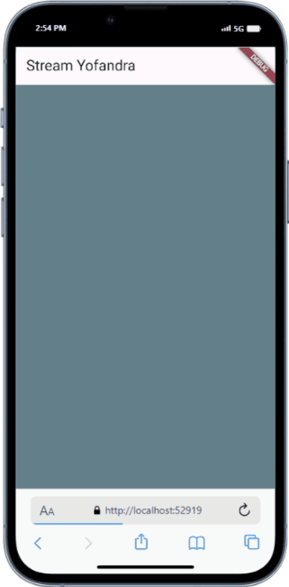

# Pemrograman Mobile - Pertemuan 13

NIM : 2141720121

Nama : Yofandra Arta Priyoga

 

#### Soal 3
* Keyword yield* digunakan untuk mendelegasikan ke Stream.periodic
* Isi perintah kode tersebut untuk menghasilkan urutan nilai setiap detik, dan fungsi ini menghasilkan warna dari arrays colors berdasarkan indeks yang dihitung dari waktu.
 

#### Soal 4
Output: 

 

#### Soal 5
Penjelasan:
listen: Eksekusi kode berlanjut setelah dipanggil. Berarti kode setelah listen dapat dieksekusi sebelum stream selesai
await for: menunda eksekusi kode sampai stream selesai. Ini berarti bahwa kode setelah await for tidak akan dieksekusi sampai semua event di stream telah diproses.