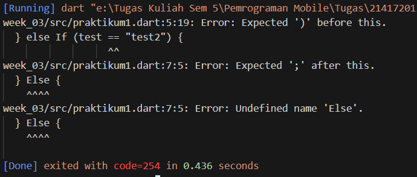
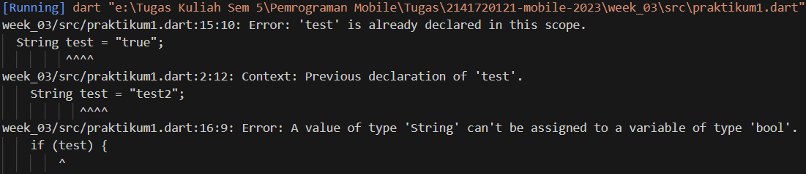
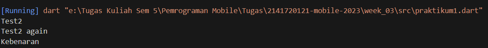
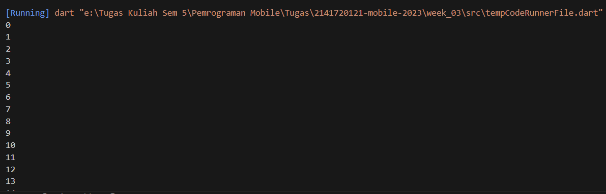
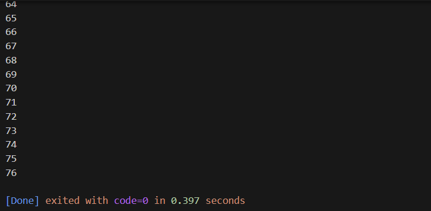
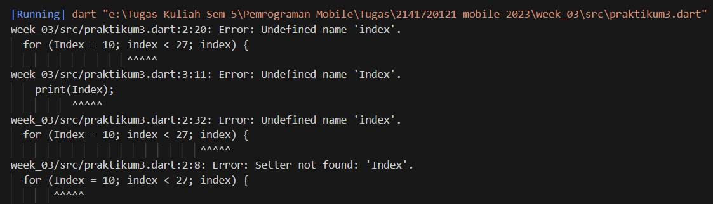
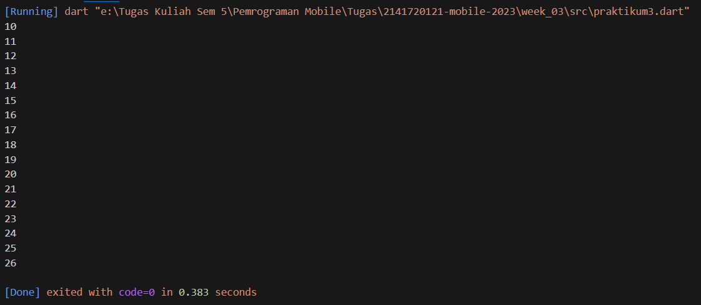
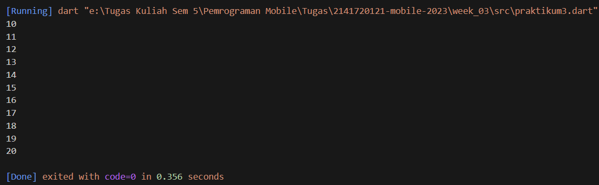
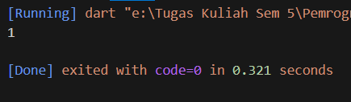
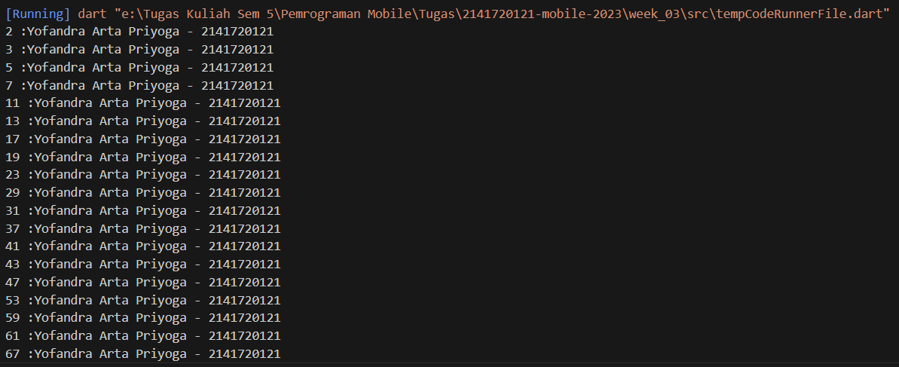

# Pemrograman Mobile - Pertemuan 3

Project Hello World

NIM : 2141720121

Nama : Yofandra Arta Priyoga

## Praktikum 1

1. Langkah 1
   Kode Program

```
void main(){
    String test = "test2";
  if (test == "test1") {
    print("Test1");
  } else If (test == "test2") {
    print("Test2");
  } Else {
    print("Something else");
  }

  if (test == "test2") print("Test2 again");
}
```

output :


2. Langkah 2
   Penjelasan: Terjadi eror pada output. Ada tiga kesalahan yaitu:

- Pada baris ke-5 penulisan 'IF' seharusnya 'if'
- Pada baris ke-7 penulisan 'Else' seharusnya 'else
- pada baris ke-11 harus diberi kurung kurawal

3. Langkah 3
   Kode Program

```
void main(){
    String test = "test2";
  if (test == "test1") {
    print("Test1");
  } else if (test == "test2") {
    print("Test2");
  } else {
    print("Something else");
  }

  if (test == "test2") {
    print("Test2 again");
  }

  String test = "true";
    if (test) {
      print("Kebenaran");
  }
}
```

Output

Penjelasan: Akan terjadi error, karena variabel 'test' sudah di definisikan dan pada if harus bernilai boolean.

Pembenaran Kode:

```
void main(){
    String test = "test2";
  if (test == "test1") {
    print("Test1");
  } else if (test == "test2") {
    print("Test2");
  } else {
    print("Something else");
  }

  if (test == "test2") {
    print("Test2 again");
  }

  String test3 = "true";
    if (true) {
      print("Kebenaran");
  }
}
```

Output


## Praktikum 2

1. Langkah 1 & 2
   Penjelasan: terjadi error karena variabel 'counter' belum di inisiasi

Perbaikan:

```
void main(){
  int counter = 0;
    while (counter < 33) {
    print(counter);
    counter++;
  }
}
```

Output


2. Langkah 3

```
void main(){
  int counter = 0;
    while (counter < 33) {
    print(counter);
    counter++;
  }

  do {
    print(counter);
    counter++;
  } while (counter < 77);
}
```

Output

Penjelasan: Kode berhasil dijalankan dan outputnya sesuai

## Praktikum 3

1. Langkah 1
   Kode Program:

```
void main() {
  for (Index = 10; index < 27; index) {
    print(Index);
  }
}
```

Output:


2. Langkah 2
   Penjelasan : Terjadi error karena variabel 'index' belum diinisiasi dan beberapa penulisan 'index' masih salah yaitu 'Index'

Perbaikan:

```
void main() {
  int index;
  for (index = 10; index < 27; index++) {
    print(index);
  }
}
```

Output:


3. Langkah 3
   Penjelasan : Terjadi error karena kesalahan penulisan 'if' 'else', tidak ada kurung kurawal, seharusnya berada di dalam perulangan, dan operator || yang seharusnya &&

Perbaikan:

```
void main() {
  int index;
  for (index = 10; index < 27; index++) {
    if (index == 21) {
      break;
    } else if (index > 1 && index < 7) {
      continue;
    }
    print(index);
  }
}
```

Output:


## Tugas Praktikum

1. Switch Case

Kode Program:

```
void main(){
  int a = 1;
  switch(a){
    case 1:
    case 2: print(a); break;
    case 3: print(a+1); break;
    default: print(a+2);break;
  }
}
```

Output:


2. Bilangan Prima

Kode Program:

```
void main(){
  for(int prima = 0; prima <= 201; prima++){
    if(prima == 0) {
      continue;
    }else if((prima % 2 == 0) && (prima != 2)){
      continue;
    }else if(prima == 1){
      continue;
    }else if((prima % 3 == 0) && (prima != 3)){
      continue;
    }else if(prima % 5 == 0 && prima != 5){
      continue;
    }else if(prima % 7 == 0 && prima != 7){
      continue;
    }else if(prima % 11 == 0 && prima != 11){
      continue;
    }else if(prima % 13 == 0 && prima != 13){
      continue;
    }
    print("$prima :Yofandra Arta Priyoga - 2141720121");
  }
}
```

Output:

